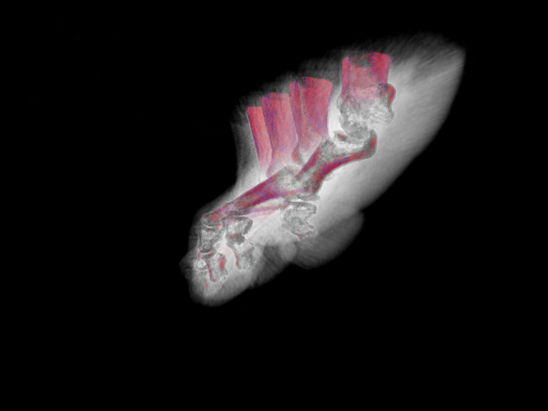
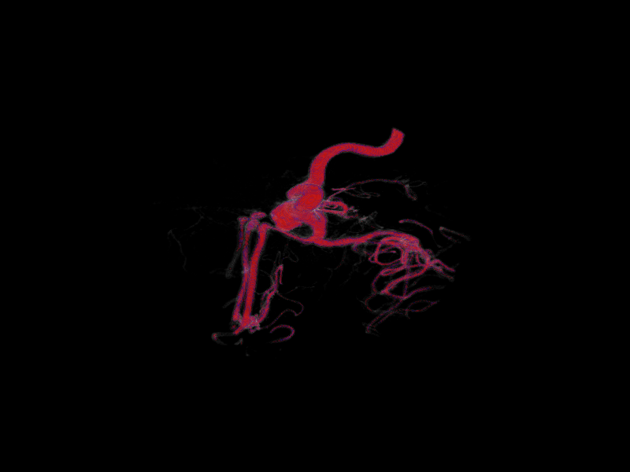

# simpleVolumeRayCaster


*simpleVolumeRayCaster* is a simple C++ example of Volume rendering using Ray Casting technique.

## Getting Started

To run this code you should have C++11 compatible compiler.

In main.cpp change file name of volume which you want to visualize, and volume dimensions:
```
   mvImageLoadFromRaw(volume,"aneurism.raw",mvSize3(256,256,256));
```


Also, need to set up transfer function:

``` 
   mvImage1_t lt = mvCreateLookUpTable({
                                        std::make_pair(0,mvColor4(0,0,0,0)),
                                        std::make_pair(0,mvColor4(0,0,0,0)),
                                        std::make_pair(100,mvColor4(0,0,0,20)),
                                        std::make_pair(120,mvColor4(100,100,100,50)),
                                        std::make_pair(160,mvColor4(10,10,10,20)),
                                        std::make_pair(180,mvColor4(200,10,40,100)),
                                        std::make_pair(200,mvColor4(200,20,20,100)),
                                        std::make_pair(225,mvColor4(20,20,200,100)),
                                        std::make_pair(255,mvColor4(200,20,20,200))
                                        });
```

## Getting Data

Data can be found on the [volvis.org](http://volvis.org/) website. If you have some problems try to use [web.archive.org](https://web.archive.org/web/20150407034236/http://volvis.org:80/) snapshot.

## Screens





## Authors

* **Maksym Tymkovych** [on github](https://github.com/MaksymTymkovych)
